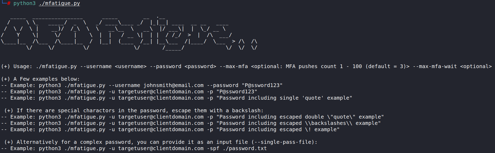

# mfatigue
A proof-of-concept Python script to cause MFA fatigue for known O365 credentials.

> This project is intended strictly for educational, authorised testing, and research purposes only. 

> The author does not assume any responsibility for the use of this project. 

> By using this project, you agree to use it at your own risk and acknowledge that the author is not liable for any misuse, damage, or legal consequences that may arise from its use.

# Table of Contents

- [Setup](#setup)
- [Usage](#usage)

## Setup

## Usage

<h2 align="center">
  
   
</h2>
